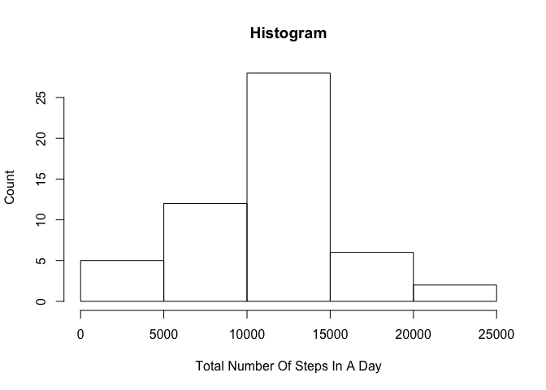
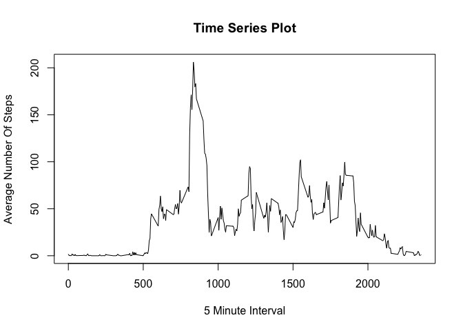
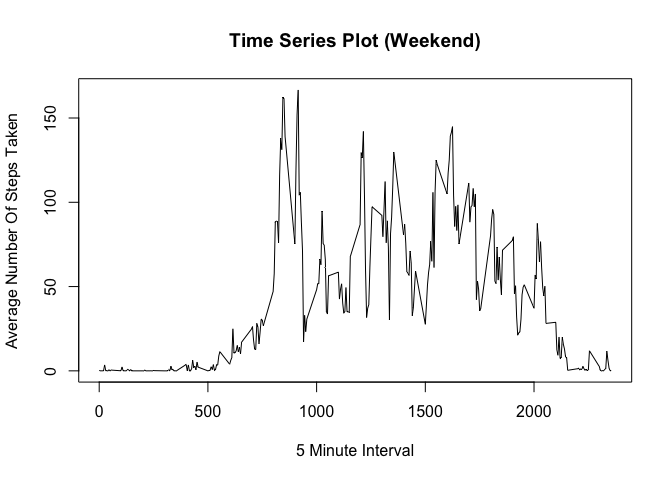
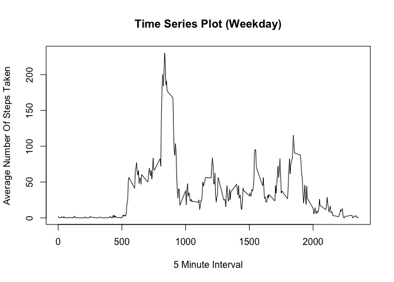

# Assignment: Course Project 1
March 13, 2016  

## Background

It is now possible to collect a large amount of data about personal movement using activity monitoring devices such as a Fitbit, Nike Fuelband, or Jawbone Up. These type of devices are part of the “quantified self” movement – a group of enthusiasts who take measurements about themselves regularly to improve their health, to find patterns in their behavior, or because they are tech geeks. But these data remain under-utilized both because the raw data are hard to obtain and there is a lack of statistical methods and software for processing and interpreting the data.

This assignment makes use of data from a personal activity monitoring device. This device collects data at 5 minute intervals through out the day. The data consists of two months of data from an anonymous individual collected during the months of October and November, 2012 and include the number of steps taken in 5 minute intervals each day.

## Data


```r
## Load libraries needed
library(knitr)
library(dplyr)
```

```
## 
## Attaching package: 'dplyr'
## 
## The following objects are masked from 'package:stats':
## 
##     filter, lag
## 
## The following objects are masked from 'package:base':
## 
##     intersect, setdiff, setequal, union
```

```r
library(Hmisc)
```

```
## Loading required package: grid
## Loading required package: lattice
## Loading required package: survival
## Loading required package: Formula
## Loading required package: ggplot2
## 
## Attaching package: 'Hmisc'
## 
## The following objects are masked from 'package:dplyr':
## 
##     combine, src, summarize
## 
## The following objects are masked from 'package:base':
## 
##     format.pval, round.POSIXt, trunc.POSIXt, units
```

```r
library(timeDate)

# Read in the data to use. 
data <- read.table(unz("activity.zip","activity.csv"), sep = ",", na.strings = "NA", header = TRUE)
```

## Exploring The Data

```r
names(data)
```

```
## [1] "steps"    "date"     "interval"
```

```r
dim(data)
```

```
## [1] 17568     3
```

## Cleaning The Data 

```r
# Subset into a data set that does not have NA values.
dataclean <- subset(data,!(is.na(data$steps)))
```
## Split & Subset The Data

```r
# Calculate the total number of steps taken per day
daysgrouped <- group_by(dataclean, date)
stepsperday <- summarise(daysgrouped, stepssum = sum(steps))
stepsperday
```

```
## Source: local data frame [53 x 2]
## 
##          date stepssum
##        (fctr)    (int)
## 1  2012-10-02      126
## 2  2012-10-03    11352
## 3  2012-10-04    12116
## 4  2012-10-05    13294
## 5  2012-10-06    15420
## 6  2012-10-07    11015
## 7  2012-10-09    12811
## 8  2012-10-10     9900
## 9  2012-10-11    10304
## 10 2012-10-12    17382
## ..        ...      ...
```

```r
# Make a histogram of the total number of steps taken each day
hist(stepsperday$stepssum, main="Histogram", xlab="Total Number Of Steps In A Day", ylab="Count")
```

 

```r
# Calculate and report the mean and median of the total number of steps taken per day
avgsteps <- mean(stepsperday$stepssum)
avgsteps
```

```
## [1] 10766.19
```

```r
median(stepsperday$stepssum)
```

```
## [1] 10765
```

```r
intervalgrouped <- group_by(dataclean, interval)
stepsperinterval <- summarise(intervalgrouped, stepsintervalsum = mean(steps))

plot(stepsperinterval$interval, stepsperinterval$stepsintervalsum, type='l', main="Time Series Plot", xlab="5 Minute Interval", ylab="Average Number Of Steps")
```

 

```r
# Which 5-minute interval, on average across all the days in the dataset, contains the maximum number of steps?
maximum <- which.max(stepsperinterval$stepsintervalsum)
stepsperinterval[maximum,]
```

```
## Source: local data frame [1 x 2]
## 
##   interval stepsintervalsum
##      (int)            (dbl)
## 1      835         206.1698
```

```r
# Sum NA count
nacount <- sum(is.na(data$steps))

# Impute missing values with the mean for that 5-minute interval.
# I got help from Stack Exchange on this one: http://stackoverflow.com/questions/9322773/how-to-replace-na-with-mean-by-subset-in-r-impute-with-plyr
impute.mean <- function(x) replace(x, is.na(x), mean(x, na.rm = TRUE))

# Create a new dataset that is equal to the original dataset but with the missing data filled in.
data2 <- data %>%
    group_by(interval) %>%
    mutate(steps = impute.mean(steps))

daysgrouped2 <- group_by(data2, date)
stepsperday2 <- summarise(daysgrouped, stepssum = sum(steps))

# Histogram of the total number of steps taken each day.
hist(stepsperday2$stepssum, main="Histogram", xlab="Total Number Of Steps In A Day", ylab="Count")
```

 

```r
# Calculate and report the mean and median total number of steps taken per day.
avgsteps <- mean(stepsperday2$stepssum)
avgsteps
```

```
## [1] 10766.19
```

```r
median(stepsperday2$stepssum)
```

```
## [1] 10765
```

These values don't really differ from the original estimates? There is not a large impact of imputing missing data on the estimates.


```r
data2$weekend <- isWeekend(data2$date)

data2weekend <- subset(data2, weekend == "TRUE")
data2weekday <- subset(data2, weekend == "FALSE")

intervalgrouped <- group_by(data2weekend, interval)
stepsperinterval <- summarise(intervalgrouped, stepsintervalsum = mean(steps))

plot(stepsperinterval$interval, stepsperinterval$stepsintervalsum, type='l', main="Time Series Plot (Weekend)", xlab="5 Minute Interval", ylab="Average Number Of Steps Taken")
```

 

```r
intervalgrouped <- group_by(data2weekday, interval)
stepsperinterval <- summarise(intervalgrouped, stepsintervalsum = mean(steps))

plot(stepsperinterval$interval, stepsperinterval$stepsintervalsum, type='l', main="Time Series Plot (Weekday)", xlab="5 Minute Interval", ylab="Average Number Of Steps Taken")
```

 
